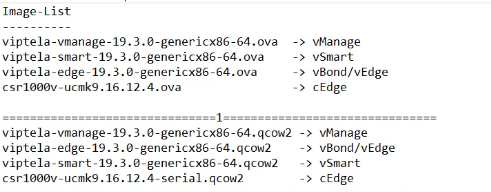
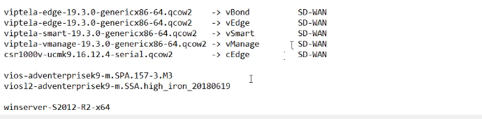

# Cisco SDWAN


```
Organization-Name: IMAN-SDWAN


```




# import image to eve-ng

```sh

cd /opt/unetlab/addons/qemu
mkdir vtbond-19.3.0
mkdir vtedge-19.3.0
mkdir vtsmart-19.3.0
mkdir vtmgmt-19.3.0


scp viptela-edge-19.3.3-genericx86.qcow2 root@eve-ng:/opt/unetlab/addons/qemu/vtbond-19.3.0

mv viptela-edge-19.3.3-genericx86.qcow2 virtioa.qcow2


and copy all of them and rename it to virtioa.qcow2


cd vtmgmt-19.3.0
/opt/qemu/bin/qemu-img create -f qcow2 virtiob.qcow2 100G

/opt/unetlab/wrappers/unl_wrapper -a fixpermissions


```
# add csr image

```sh
cd /opt/unetlab/addons/qemu
mkdir csr1000vng-ucmk9.16.12.1b-sdwan
# copy and rename and fix permision


```

# pull viso-images

```
vios-adventerprisek9-m.SPA.159-3.M3

viosl2-adventerprisek9-m.ssa.high_iron_20190423

```

we need below things:
* Organization name
* System-IP
* Address of the vBond Controller
* Site-ID
* IP address of VPN0
* [optional] an address for vpn512
* [optional] NTP server


# Organization-Name: IMAN-SDWAN


# Domain-name: IMAN-SDWAN.local


# vmanage configurations

```sh
config terminal
system
site-id 1
system-ip 1.1.1.2
organization-name "IMAN-SDWAN"
vbond 17.25.2.2
ntp server 172.2.2.2
vpn 0
ip route 0.0.0.0/0 192.168.1.1
interface eth0
ip address 192.168.1.2/24
no shutdown
tunnel-interface
```